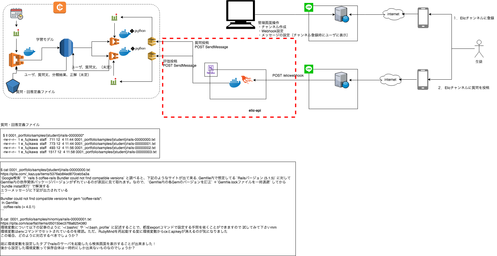

# ElicApi

## Architecture



## Basic

To start your Phoenix server:

  * Install dependencies with `mix deps.get`
  * Create and migrate your database with `mix ecto.setup`
  * Install Node.js dependencies with `cd assets && npm install`
  * Start Phoenix endpoint with `mix phx.server`

Now you can visit [`localhost:4000`](http://localhost:4000) from your browser.

Ready to run in production? Please [check our deployment guides](https://hexdocs.pm/phoenix/deployment.html).

## Learn more

  * Official website: http://www.phoenixframework.org/
  * Guides: https://hexdocs.pm/phoenix/overview.html
  * Docs: https://hexdocs.pm/phoenix
  * Mailing list: http://groups.google.com/group/phoenix-talk
  * Source: https://github.com/phoenixframework/phoenix

## Note

```
  737  mix archive.uninstall phx_new-1.4.0-rc.2
  738  mix archive
  739  mix archive.install hex phx_new 1.4.0
  743  mix phx.new --app elic_api elic-api
  744  cd elic-api/
  747  git init
  748  git remote add origin git@github.com:Eigo-Mt-Fuji/elic-api.git
  749  git fetch origin
  750  git add ./
  752  git status
  754  git commit -m "init"
  757  mix deps.get
  762  git push origin master
```

